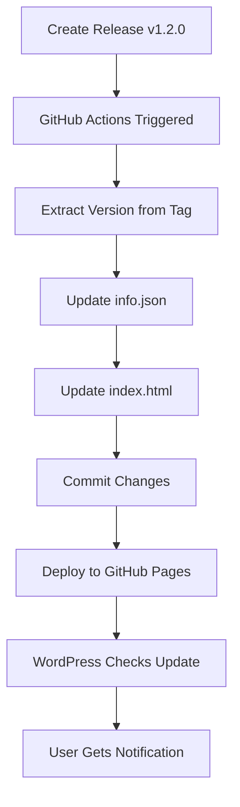

# ASMAK Command Center - GitHub Pages Update System

## 📚 Dokumentasi Lengkap

Sistem auto-update gratis menggunakan GitHub Pages untuk WordPress Plugin.

---

## 🎯 Fitur Sistem

- ✅ **Auto-update otomatis** via GitHub Pages (100% gratis)
- ✅ **GitHub Actions workflow** untuk update otomatis saat release
- ✅ **Landing page profesional** dengan statistik plugin
- ✅ **Info.json** dengan metadata lengkap
- ✅ **WordPress updater class** siap pakai
- ✅ **Zero maintenance** - semua otomatis

---

## 🚀 Cara Setup GitHub Pages

### 1. Enable GitHub Pages

1. Buka repository settings di GitHub
2. Scroll ke bagian **Pages**
3. Di **Source**, pilih `gh-pages` branch
4. Klik **Save**
5. Tunggu beberapa saat hingga site deployed
6. URL akan tersedia di: `https://adsguru22.github.io/asmak-updates/`

### 2. Verifikasi Setup

Akses URL berikut untuk memastikan setup berhasil:
- Landing page: `https://adsguru22.github.io/asmak-updates/`
- Info JSON: `https://adsguru22.github.io/asmak-updates/info.json`

---

## 📝 Struktur File Repository

```
asmak-updates/
├── .github/
│   └── workflows/
│       └── update-info.yml          # Auto-update workflow
├── plugin-integration/
│   ├── updater.php                  # WordPress updater class
│   └── example-integration.php      # Contoh implementasi
├── assets/                          # (opsional) Banner & icon
│   ├── banner-772x250.png
│   ├── banner-1544x500.png
│   ├── icon-128x128.png
│   └── icon-256x256.png
├── info.json                        # Plugin metadata
├── index.html                       # Landing page
├── SETUP_GUIDE.md                   # File ini
└── README.md                        # Repository readme
```

---

## 🔧 Integrasi ke WordPress Plugin

### 1. Copy File Updater

Copy file `plugin-integration/updater.php` ke folder plugin Anda:
```
your-plugin/
├── includes/
│   └── updater.php      # Copy file ini
└── your-plugin.php
```

### 2. Modifikasi Plugin Utama

Edit file plugin utama Anda (misalnya `asmak-command-center.php`):

```php
<?php
/**
 * Plugin Name: ASMAK Command Center
 * Plugin URI: https://github.com/adsguru22/asmak-updates
 * Description: Command Center untuk integrasi berbagai API
 * Version: 1.2.0
 * Author: ASMAK Team
 * Author URI: https://github.com/adsguru22
 * Requires at least: 5.0
 * Requires PHP: 7.4
 * Text Domain: asmak-command-center
 */

if (!defined('ABSPATH')) {
    exit;
}

// Load plugin updater
require_once plugin_dir_path(__FILE__) . 'includes/updater.php';

// Initialize auto-updater (admin only)
if (is_admin()) {
    $updater = new ASMAK_Plugin_Updater(__FILE__);
    $updater->set_update_url('https://adsguru22.github.io/asmak-updates/info.json');
    $updater->initialize();
}

// Your plugin code here...
```

### 3. Test Update Checker

1. Install plugin di WordPress
2. Buka **Dashboard > Updates**
3. Update checker akan otomatis cek versi terbaru dari GitHub Pages

---

## 📦 Cara Release Plugin Baru

### 1. Siapkan File ZIP

Buat file ZIP dari plugin Anda:
```bash
cd /path/to/your/plugin
zip -r asmak-command-center.zip . -x "*.git*" "node_modules/*" ".DS_Store"
```

### 2. Update Version

Update version number di:
- Plugin header (file utama)
- `readme.txt` (jika ada)

### 3. Create GitHub Release

1. Buka repository GitHub
2. Klik **Releases** > **Create a new release**
3. Tag version: `v1.2.0` (sesuaikan versi)
4. Release title: `Version 1.2.0`
5. Deskripsi: changelog/perubahan
6. Upload file `asmak-command-center.zip`
7. Klik **Publish release**

### 4. Workflow Otomatis Berjalan

Setelah release dipublish:
- GitHub Actions akan otomatis berjalan
- `info.json` akan di-update dengan versi baru
- `index.html` akan di-update
- Perubahan akan di-deploy ke GitHub Pages
- Plugin WordPress akan detect update baru dalam 12 jam

---

## 🔍 Cara Kerja Sistem

### Workflow Update Otomatis



### WordPress Update Check

1. WordPress secara periodik check update (atau manual via Dashboard)
2. Plugin updater memanggil URL: `https://adsguru22.github.io/asmak-updates/info.json`
3. Compare version di `info.json` dengan version plugin terinstall
4. Jika versi lebih baru, tampilkan notifikasi update
5. User klik update, WordPress download ZIP dari GitHub Release
6. Plugin ter-update otomatis

---

## ⚙️ Kustomisasi

### Update Plugin Metadata

Edit file `info.json` untuk mengubah:
- Nama plugin
- Deskripsi
- Requirements
- Changelog
- Banner & icon URLs

### Update Landing Page

Edit `index.html` untuk:
- Mengubah design/styling
- Update statistik
- Menambah informasi
- Customize branding

### Modify Workflow

Edit `.github/workflows/update-info.yml` untuk:
- Mengubah trigger (misalnya tambah manual dispatch)
- Custom commit message
- Tambah notifikasi (email, Slack, dll)

---

## 🛡️ Keamanan

### Best Practices

1. **Validasi ZIP File**: Pastikan file ZIP aman sebelum upload
2. **Version Control**: Gunakan semantic versioning (v1.2.3)
3. **Testing**: Test plugin sebelum release
4. **Backup**: Selalu backup sebelum update

### Security Checklist

- ✅ Update checker menggunakan HTTPS
- ✅ File ZIP di-host di GitHub (trusted source)
- ✅ WordPress built-in update mechanism
- ✅ Transient caching (12 jam) untuk reduce request

---

## 🐛 Troubleshooting

### Update Tidak Muncul

1. **Clear cache**: `wp transient delete asmak_plugin_update_*`
2. **Check URL**: Pastikan `info.json` accessible
3. **Verify version**: Version di `info.json` harus lebih tinggi
4. **Check logs**: Enable `WP_DEBUG` untuk lihat error

### Workflow Gagal

1. **Check workflow logs** di GitHub Actions tab
2. **Verify permissions**: Pastikan workflow punya write access
3. **Check JSON syntax**: Validasi `info.json` dengan JSONLint
4. **Manual trigger**: Coba run workflow manual via Actions tab

### GitHub Pages Tidak Update

1. **Check deployment status** di Settings > Pages
2. **Verify branch**: Pastikan deploying dari `gh-pages`
3. **Check Actions**: Lihat apakah deployment success
4. **Wait**: GitHub Pages kadang butuh waktu 1-5 menit

---

## 📊 Monitoring

### Track Update Success

Monitor via:
1. **GitHub Actions**: Success/failure status
2. **GitHub Pages**: Deployment status
3. **WordPress**: Update statistics via admin

### Analytics (Optional)

Tambahkan Google Analytics di `index.html` untuk track:
- Visitor landing page
- Download count
- Geographic distribution

---

## 💡 Tips & Tricks

### 1. Automatic Changelog

Gunakan GitHub Release notes sebagai changelog:
```yaml
# Di workflow, extract release notes
- name: Get Release Notes
  run: |
    NOTES=$(gh release view $TAG --json body -q .body)
    # Update changelog di info.json
```

### 2. Version Bump Script

Buat script untuk auto-increment version:
```bash
#!/bin/bash
# bump-version.sh
current_version=$(jq -r '.version' info.json)
# Increment version logic...
```

### 3. Pre-release Testing

Gunakan pre-release untuk beta testing:
```yaml
on:
  release:
    types: [published, prereleased]
```

### 4. Multiple Channels

Support stable & beta channels:
- `info.json` - stable channel
- `info-beta.json` - beta channel

---

## 🤝 Kontribusi

Untuk berkontribusi:
1. Fork repository
2. Create feature branch
3. Commit changes
4. Push dan create Pull Request

---

## 📞 Support

Butuh bantuan? 
- GitHub Issues: [Create Issue](https://github.com/adsguru22/asmak-updates/issues)
- Documentation: File ini

---

## 📄 License

Free and open source. Gunakan sesuka Anda!

---

## 🎉 Selamat!

Setup GitHub Pages auto-update system Anda sudah lengkap! 

**Next Steps:**
1. ✅ Enable GitHub Pages
2. ✅ Create first release
3. ✅ Integrate updater ke plugin
4. ✅ Test update mechanism

---

*Last Updated: 2025-12-16*
